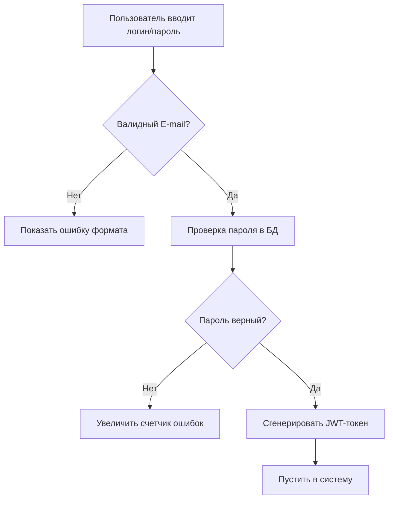

```mermaid
graph TD
    A[Пользователь вводит логин/пароль] --> B{Валидный E-mail?}
    B -- Нет --> C[Показать ошибку формата]
    B -- Да --> D[Проверка пароля в БД]
    D --> E{Пароль верный?}
    E -- Нет --> F[Увеличить счетчик ошибок]
    E -- Да --> G[Сгенерировать JWT-токен]
    G --> H[Пустить в систему]
```
